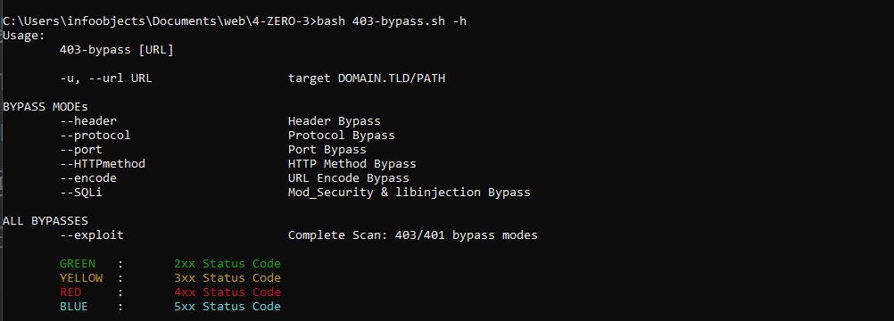

# 4-ZERO-3 🚀

4-ZERO-3 is a tool designed to bypass HTTP 403/401 errors. This script includes all the possible techniques to achieve this goal.

```bash
root@0xrisec:$ bash 403-bypass.sh -h
```


## Usage / Modes

- Scan with specific payloads:
  * [ `--header` ] Support HEADER based bypasses/payloads
    ```bash
    root@0xrisec:$ bash 403-bypass.sh -u https://target.com/secret --header
    ```
  * [ `--protocol` ] Support PROTOCOL based bypasses/payloads
    ```bash
    root@0xrisec:$ bash 403-bypass.sh -u https://target.com/secret --protocol
    ```
  * [ `--port` ] Support PORT based bypasses/payloads
    ```bash
    root@0xrisec:$ bash 403-bypass.sh -u https://target.com/secret --port
    ```
  * [ `--HTTPmethod` ] Support HTTP Method based bypasses/payloads
    ```bash
    root@0xrisec:$ bash 403-bypass.sh -u https://target.com/secret --HTTPmethod
    ```
  * [ `--encode` ] Support URL Encoded bypasses/payloads
    ```bash
    root@0xrisec:$ bash 403-bypass.sh -u https://target.com/secret --encode
    ```
  * [ `--SQLi` ] Support MySQL mod_Security & libinjection bypasses/payloads [** New **]
    ```bash
    root@0xrisec:$ bash 403-bypass.sh -u https://target.com/secret --SQLi
    ```
- Complete Scan {includes all exploits/payloads} for an endpoint [ --exploit ]
```bash
root@0xrisec:$ bash 403-bypass.sh -u https://target.com/secret --exploit
```
